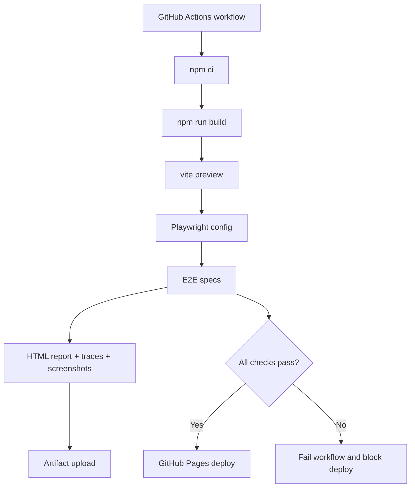

# Design Document

## Overview

This design adds a Playwright end-to-end testing layer and wires it into the repository's GitHub Actions deployment path. The implementation keeps the existing React + Vite + Zustand application intact, adds only the minimum UI hooks needed for reliable browser automation, and ensures deployment is gated by build and Playwright validation before publishing to GitHub Pages.

The design standardizes the repository on `npm` as the automation entrypoint because the project guidance and existing local workflow already document `npm install`, `npm run build`, and `npm run dev`. CI and documentation will be updated to align with that choice so local and hosted validation use the same commands.

## Steering Document Alignment

### Technical Standards (tech.md)
No `tech.md` steering document currently exists in `.spec-workflow/steering/`. This design therefore follows the repository's existing technical standards from code and project guidance:

- TypeScript + React function components remain the application layer.
- Vite remains the build and preview server.
- Zustand remains the state layer and is not replaced for testability.
- GitHub Actions remains the CI/CD platform.
- Playwright is added as the browser automation framework with official HTML report, trace, screenshot, and video artifacts as needed for debugging.

### Project Structure (structure.md)
No `structure.md` steering document currently exists in `.spec-workflow/steering/`. The implementation follows the current repository organization:

- App runtime code stays under `src/`.
- CI definitions stay under `.github/workflows/`.
- Playwright configuration lives at repo root in dedicated config/support files.
- End-to-end specs live in a dedicated test folder outside `src/` so runtime code and test harness concerns remain separated.
- Any testability-oriented UI hooks are added in small, focused updates to existing components rather than by introducing test-only runtime modules.

## Code Reuse Analysis

The feature reuses the current application behavior rather than introducing a parallel test app. Tests will drive the actual production UI:

### Existing Components to Leverage
- **`src/App.tsx`**: Central entrypoint for add, reorder, remove, and audio-load flows. It is the correct place to verify top-level integration behavior.
- **`src/components/AddPadModal.tsx`**: Existing add-pad flow will be targeted by Playwright to create pads through the real modal.
- **`src/components/PadGrid.tsx`**: Existing DnD Kit reorder integration is the correct surface for reorder tests.
- **`src/components/Pad.tsx`**: Existing click-to-play and delete confirmation behavior will be exercised directly. Small selector hooks may be added here.
- **`src/components/TopMenu.tsx`**: Existing buttons for add/delete/reorder/default load/stop provide the main E2E control surface and are the natural place for stable selectors.
- **`src/store/padStore.ts`**: Existing persisted pad state and IndexedDB-backed audio restoration logic define the main functional scenarios that tests need to cover.
- **`src/store/howlerStore.ts`**: Existing sound playback logic will remain the source of truth; tests may observe UI state or mock/stub browser audio behavior around it rather than replacing it.

### Integration Points
- **GitHub Actions**: New CI validation job and deployment gating will integrate with the existing `.github/workflows/deploy.yaml`.
- **Vite build/preview**: Playwright will run against a built app served by `vite preview`, not only against the dev server.
- **GitHub Pages hosting**: Tests must account for the repository base path `/tiger-sound-pad` already defined in `vite.config.ts`.
- **IndexedDB + browser dialogs**: The existing add/delete flows rely on browser storage and `window.confirm`, which will be handled in Playwright through isolated browser contexts and dialog interception.

## Architecture

The implementation introduces four layers:

1. A Playwright config layer that defines browser projects, the web server command, artifact retention, and the base URL.
2. A test support layer for reusable selectors, optional seeded helpers, and Playwright fixtures.
3. A minimal app instrumentation layer that adds stable selectors and accessibility-friendly hooks to the existing UI.
4. A CI/CD workflow layer that installs dependencies, builds the app, runs Playwright, uploads artifacts, and only then deploys.

The key design choice is to test the production-like artifact with `vite preview` so CI validates the same asset layout and base path behavior that GitHub Pages serves.

### Modular Design Principles
- **Single File Responsibility**: Playwright config owns runner setup, test specs own scenario assertions, and workflow YAML owns CI/CD orchestration.
- **Component Isolation**: Runtime UI changes are limited to stable selectors and small accessibility improvements within existing components.
- **Service Layer Separation**: Browser test helpers do not embed app business logic; they only drive public UI and browser APIs.
- **Utility Modularity**: Reusable selectors, constants, and fixtures live in dedicated support files so spec files stay scenario-focused.



## Components and Interfaces

### Playwright Runner Configuration
- **Purpose:** Define the shared test runner behavior for local and CI execution.
- **Interfaces:** `playwright.config.ts` with `testDir`, `use`, `projects`, `webServer`, retries, reporter config, and artifact retention settings.
- **Dependencies:** `@playwright/test`, Vite preview command, repository base path, CI environment variables.
- **Reuses:** Existing `npm run build` and `npm run preview` behavior.

### E2E Spec Suite
- **Purpose:** Validate the critical user flows through the real browser UI.
- **Interfaces:** Playwright spec files such as smoke/basic interaction specs and focused regression scenarios.
- **Dependencies:** Stable selectors from runtime components, Playwright fixtures/helpers, seeded browser state where needed.
- **Reuses:** Existing App, modal, menu, pad interaction, delete confirmation, and reorder behavior.

### Selector and Fixture Support
- **Purpose:** Provide stable test hooks and small reusable helpers so specs are not tightly coupled to presentational CSS or fragile text order.
- **Interfaces:** Helper modules exporting selector constants, optional custom fixtures, and browser setup helpers for dialog handling or test data creation.
- **Dependencies:** Playwright `test` APIs and explicit `data-testid` or `aria-*` hooks added to runtime components.
- **Reuses:** Existing accessible buttons and labels where already present.

### CI/CD Workflow Integration
- **Purpose:** Gate deployment on automated validation and expose debugging artifacts in GitHub Actions.
- **Interfaces:** Updated workflow YAML with validation and deploy jobs, job dependencies, artifact upload steps, and GitHub Pages deployment integration.
- **Dependencies:** `actions/checkout`, `actions/setup-node`, npm lockfile, Playwright browser install command, GitHub Pages deployment actions or existing deploy action.
- **Reuses:** Existing repository workflow path and current build/deploy process.

### Documentation Updates
- **Purpose:** Explain how contributors run Playwright locally, what CI does, and how failures are inspected.
- **Interfaces:** README updates and optional `docs/plan` note referencing the new automation flow.
- **Dependencies:** Final command names and workflow file names.
- **Reuses:** Existing README sections for development and deployment.

## Data Models

### Playwright Runtime Configuration
```ts
type PlaywrightRuntimeConfig = {
  baseURL: string;
  ci: boolean;
  retries: number;
  workers: number | undefined;
  webServerCommand: string;
  htmlReportFolder: string;
  artifactFolder: string;
};
```

Notes:
- `baseURL` should resolve to `http://127.0.0.1:4173/tiger-sound-pad/` for preview-backed runs unless an explicit override is provided.
- `webServerCommand` should build on the repository's preview script rather than inventing a separate server implementation.

### Test Surface Model
```ts
type PadTestSurface = {
  addButton: string;
  addModal: string;
  padButton: string;
  deleteModeButton: string;
  reorderModeButton: string;
  stopButton: string;
};
```

Notes:
- These are selector contracts, not application state models.
- The implementation should prefer `data-testid` plus meaningful roles/names for long-term stability.

## Error Handling

### Error Scenarios
1. **Scenario 1:** `vite preview` starts but Playwright cannot load the app because the repository base path is wrong for the test URL.
   - **Handling:** Centralize the Playwright `baseURL` and navigation path in config/helpers and explicitly include `/tiger-sound-pad/` in preview-mode execution.
   - **User Impact:** CI fails early with navigation errors rather than producing false-green results against the wrong path.

2. **Scenario 2:** Drag-and-drop assertions are flaky because selectors depend on visual order or because the drag target is not stable across browsers.
   - **Handling:** Add explicit test IDs to sortable pads and use Playwright drag helpers or pointer interactions against those stable targets, with assertions on resulting DOM order or label sequence.
   - **User Impact:** Reorder tests remain stable and actionable instead of intermittently failing without product regressions.

3. **Scenario 3:** Audio playback flow is difficult to validate in CI due to browser media behavior.
   - **Handling:** Assert user-visible playback side effects that already exist, such as active animation/class changes or stop-state transitions, and only add a minimal explicit hook if the current UI does not expose a reliable signal.
   - **User Impact:** The suite verifies that the play interaction still works without depending on actual speakers or manual verification.

4. **Scenario 4:** CI failures are hard to diagnose because only a pass/fail status is visible.
   - **Handling:** Upload Playwright HTML report and failure artifacts, and enable traces on retry or failure-oriented mode to balance debugging value and runtime cost.
   - **User Impact:** Maintainers can inspect failures directly from the Actions run.

5. **Scenario 5:** Package-manager mismatch causes CI to pass locally but fail in GitHub Actions.
   - **Handling:** Standardize scripts and workflow commands on `npm`, commit the matching npm lockfile, and update documentation so local and CI entrypoints are identical.
   - **User Impact:** Contributors follow one consistent setup path and avoid toolchain drift.

## Testing Strategy

### Unit Testing
- No new unit-test framework is required for this feature itself.
- Any helper utilities introduced for selectors or path resolution should remain simple and typed enough to need minimal dedicated unit coverage unless they grow beyond trivial logic.

### Integration Testing
- Validate that Playwright can boot the built app through `vite preview`.
- Validate that GitHub Actions job dependencies block deployment when Playwright fails.
- Validate that artifact upload runs on failure paths so diagnostics are preserved.

### End-to-End Testing
- Add a smoke test that loads the app shell through the GitHub Pages base path.
- Add a create-pad scenario using the real add modal and form submission.
- Add a delete-pad scenario covering delete mode and confirm dialog acceptance.
- Add a reorder scenario covering reorder mode and DnD Kit movement.
- Add a playback regression scenario covering pad click and visible playback state transition.
- Run the default E2E suite on Chromium in CI first; other browsers can remain a future expansion once the smoke path is stable.
